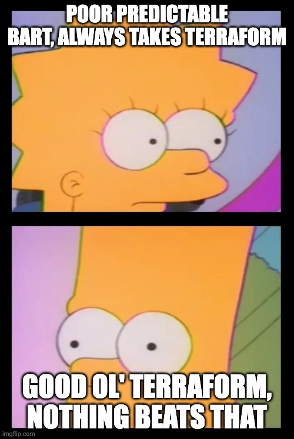

# `terraform plan`

Can be good if executed well. You create proper modules with guard rails. `modules/postgres` has encryption on, backups on, tags enforced, sensible defaults.

But...

Where and how do you store the state file? Running `plan`, takes too long.

No-one wants to wait, so they start mixing PR content with more stuff
so they don't have to plan too often.

Review time is a thing unless you start _trusting_ people. **shudder**.

The infra repo has three hundred open pull requests in under a week.

People start to be impatient and a sneaky little bugger figures out how to run `apply` from their laptop against the infra
on 16:44 on a Wednesday.

The output:

```console
Plan: 0 to add, 0 to change, 47 to destroy.
```


